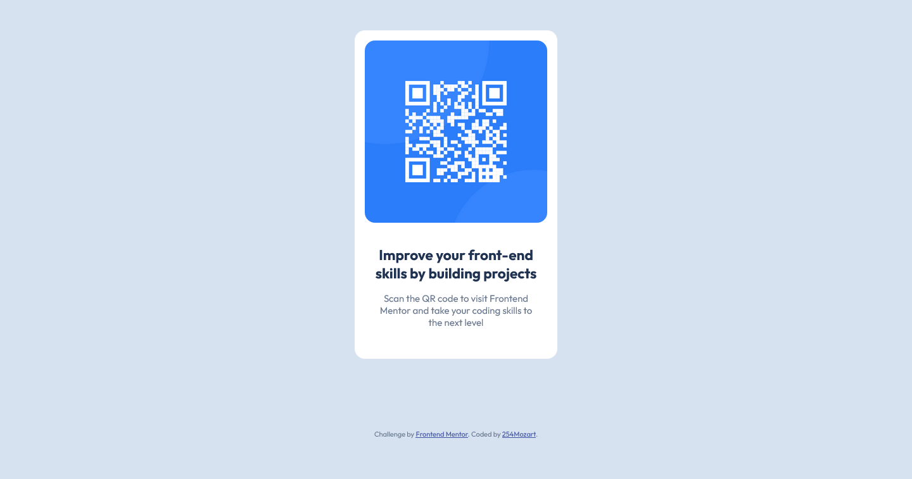

# Frontend Mentor - QR code component solution

This is a solution to the [QR code component challenge on Frontend Mentor](https://www.frontendmentor.io/challenges/qr-code-component-iux_sIO_H). Frontend Mentor challenges help you improve your coding skills by building realistic projects.

## Table of contents

- [Overview](#overview)
  - [Screenshot](#screenshot)
  - [Links](#links)
- [My process](#my-process)
  - [Built with](#built-with)
  - [What I learned](#what-i-learned)
  - [Continued development](#continued-development)
  - [Useful resources](#useful-resources)
- [Author](#author)
- [Acknowledgments](#acknowledgments)

## Overview

### Screenshot




### Links

- Solution URL: [Github solution repo](https://github.com/254mozart/qr-code-component)
- Live Site URL: [Live site]()

## My process

### Built with

- Semantic HTML5 markup
- CSS custom properties
- Flexbox
- CSS Grid
- Mobile-first workflow
- SASS preprocessor
- Accessibility

### What I learned

Got a good grasp of usind min and max dimensions. It really removes for numerous media queries

```css
main {
  width: 85%;
  max-width: 20rem;
}
```

### Continued development

I want more practice that will help me get better at SCSS. This project was really helpful.

## Author

- Frontend Mentor - [@254mozart](https://www.frontendmentor.io/profile/254mozart)
